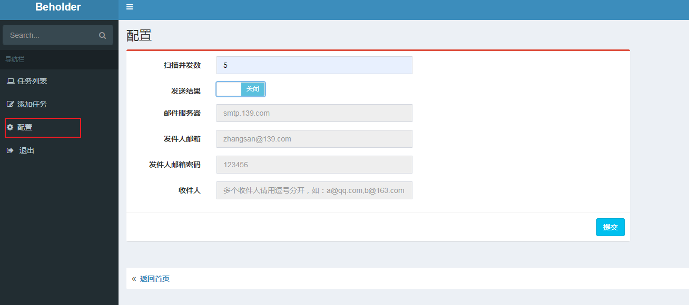
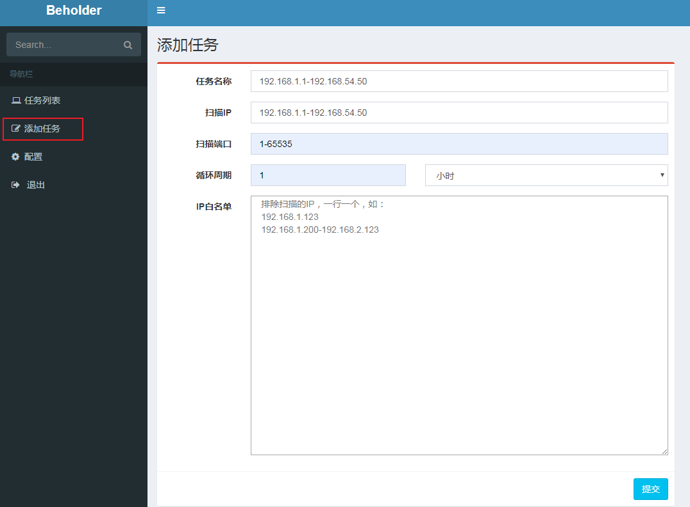
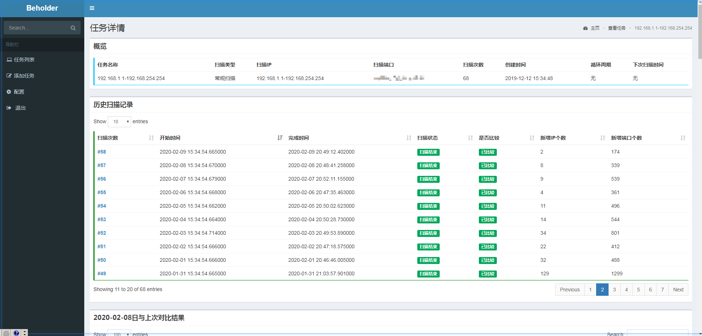
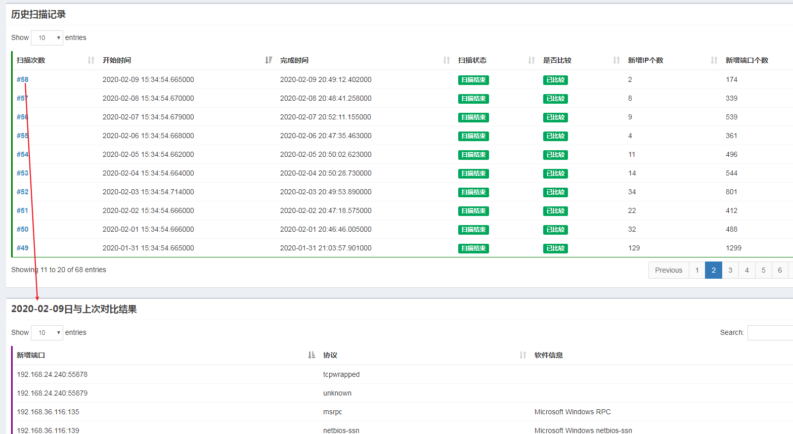

# beholder 

## 介绍

**beholder**是一款简洁而小巧的系统，主要作用是通过监控端口变化来发现企业内部的信息孤岛。例如：运维或开发新部署了一台机器未通知安全。

系统由 `beholder_scanner`、 `beholder_web`  两个部分组成。这两个部分可以部署在一台机器上，也可以分开部署在不同的机器上。**当前项目为 `beholder_web`部分**。

* **beholder_scanner**：对IP进行端口扫描、比较端口变化，可部署多个beholder_scanner来组成集群加快扫描速度。
* **beholder_web**：提供前端界面展示。

## 支持平台

* Linux
* Windows

## 安装指南（以下操作均在centos 7上进行）

[](https://www.python.org/) 
[](https://www.mongodb.com/download-center?jmp=nav)
[](https://redis.io/)

**依赖：项目运行依赖于mongodb和redis，所以需准备好mongodb和redis，mongodb和redis安装请参考：**

* [mongodb安装](./docs/mongodb.md)
* [redis安装](./docs/redis.md)

### 1. 安装python依赖库

```
# pip install -r requirements.txt
```

### 2. 修改配置文件

首先将`config.env.sample`复制一份重命名为`config.env`
```
# cp config.env.sample config.env
```

然后按照自己的要求修改配置：

```
# username and password
ACCOUNT="admin"
PASSWORD="admin"

# mongodb
MONGO_IP = '192.168.47.168'
MONGO_PORT = 27018
MONGO_USER = 'scan'
MONGO_PWD = '123456'
MONGO_DB_NAME = 'portscan'

# redis
REDIS_IP = "192.168.47.168"
REDIS_PORT = "6378"
REDIS_PWD = "pwd"
```

### 3. 启动

在程序目录下执行如下命令：

```
# python main.py
```


## 使用手册

### 1. 配置
登陆平台后，需要在【配置】中设置扫描并发数。如果需要把比较结果发送邮箱，请配置邮件相关信息。


### 2. 新增扫描任务
在【添加任务】页面中，添加需要监控的IP段和端口。注意：
* 任务名称不能重复
* 如果循环周期选择【不循环】，则添加的是一次性任务
* 如果一个循环周期内扫描没有完成，下个循环周期开始时不会添加任务


### 3. 扫描详情
点击【任务列表】->【扫描详情】

在【扫描详情】页面，点击【扫描次数】，可以查看每次扫描的IP变化。
